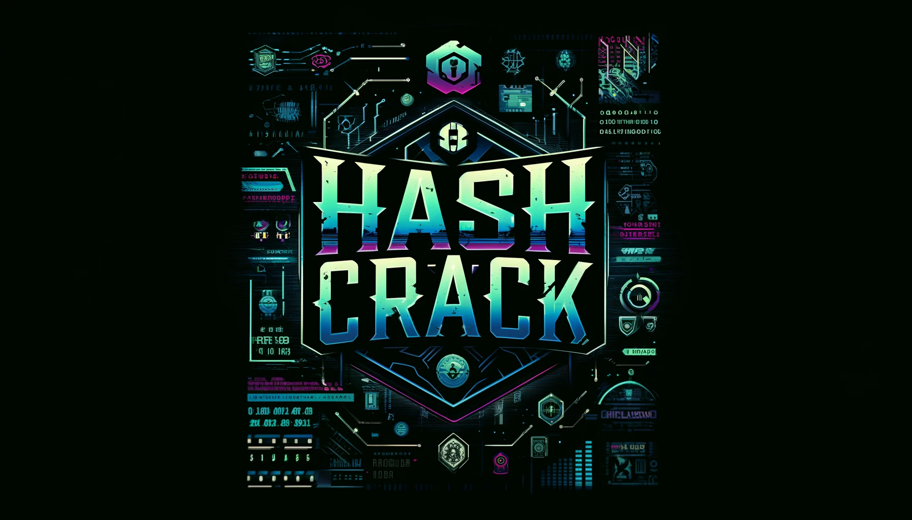

<!DOCTYPE html>
<html lang="en">
<head>
    <meta charset="UTF-8">
    <meta name="viewport" content="width=device-width, initial-scale=1.0">
</head>
<body>
    
<h1>Hash Crack</h1>

    

        
    

    

        <h3> This code does NOT promote or encourage any illegal activities!</h3>
        <h3> I created this tool for educational purpose only</h3>
        <h3>In the realm of cybersecurity, passwords are the keys to our digital kingdoms. Imagine each password as a fortress protecting your most valuable treasures. However, not all fortresses are built the same; some are strong and impenetrable, while others are weak and easily breached.</h3>
        <h3>This project is a metaphorical journey into the importance of creating strong, secure passwords. By using this tool, you will understand how easily weak passwords can be compromised and why it's crucial to build robust defenses against potential intruders.</h3>
        <h3>Our tool compares password hashes to highlight vulnerabilities in commonly used passwords. It's designed to educate and raise awareness about the necessity of using complex, unique passwords that cannot be easily guessed or cracked.</h3>
    

     
    

        <a href="#title">Intro</a> &nbsp;|&nbsp;
        <a href="#description">Description</a> &nbsp;|&nbsp;
        <a href="#requirements">Requirements</a> &nbsp;|&nbsp;
        <a href="#install">Install</a> &nbsp;|&nbsp;
        <a href="#start">Start Program</a> &nbsp;|&nbsp;
        <a href="#menu">Menu</a> &nbsp;|&nbsp;
        <a href="#supported-algorithms">Supported Algorithms</a> &nbsp;|&nbsp;
        <a href="#summary">Summary</a> &nbsp;|&nbsp;
    

     
     
    

        <h2>Description</h2>
        
<strong>Hash Crack</strong> is a Python-based tool designed to crack password hashes using a dictionary attack. The program allows for simultaneous cracking of multiple hashes by leveraging multi-core processing; for instance, if you have 3 CPU cores, it will compare 3 hashes concurrently. After the process is complete, a report of the cracked hashes will be generated in the "output" directory.

        
Hash Crack also supports the merging of multiple dictionaries into a single large dictionary to facilitate comprehensive password testing.

        
<strong>IMPORTANT!!</strong> If you find a password that you use within any of the dictionary lists, change it immediately. This indicates that the password has likely been compromised for a long time, and this tool demonstrates just how easily it can be cracked.

    

    

        <h2>Key Features</h2>
        <ul>
            <li><strong>Multi-Hash Cracking:</strong> Ability to crack several hashes concurrently, utilizing multiple CPU cores for efficiency.</li>
            <li><strong>Supported Hash Algorithms:</strong> Includes support for a wide range of hash algorithms, such as SHA-256, MD5, SHA3-256, and many more.</li>
            <li><strong>Customizable Parameters:</strong> Allows customization of encoding formats and the number of processing cores used.</li>
            <li><strong>Dictionary Attack:</strong> Utilizes dictionary files to perform attacks, and supports merging multiple dictionaries for comprehensive testing.</li>
            <li><strong>Real-Time Reporting:</strong> Generates a report in real-time, updating with each cracked hash.</li>
        </ul>
    

    

        <h2>Requirements</h2>
        <ul>
            <li>Python 3.11</li>
            <li>Termcolor module</li>
            <li>Art module</li>
        </ul>
    

     
    

        <h2>Install</h2>
        
To install the tool, follow these steps:

        <ol>
            <li>Clone the repository:</li>
            <pre><code>git clone https://github.com:LittleAtariXE/HashCrack.git</code></pre>
            <li>Navigate to the project directory:</li>
            <pre><code>cd HashCrack</code></pre>
            <li>Install the required dependencies:</li>
            <pre><code>pip install -r requirements.txt</code></pre>
        </ol>
    

    

        <h2>Start</h2>
        
To start the program, enter the following command in the console:

        <pre><code>python3 hc.py</code></pre>
        
You can also add optional parameters:

        <ul>
            <li><code>encode_format=ascii</code> - Before converting the password to its hash form, it must be transformed into a byte value. This parameter sets the encoding to "ascii". The default is "utf-8".</li>
            <li><code>process_num=3</code> - By default, each hash is cracked using one core (one processor). This means if you have 4 cores, the program will automatically check 4 hashes simultaneously. This parameter allows you to change the number of Python processes. For example, if you have 4 cores, you can force the use of only 2 processes, or if you have 2 cores, you can use up to 10 processes.</li>
        </ul>
        
These parameters are optional, and you do not need to specify them.

        
After starting the program, the following directories will be created in the program directory:

        <ul>
            <li><code>input</code> - Place the list of hashes to be cracked here (preferably using a .txt file). Hashes should be listed one per line. Two formats are acceptable:
                <ul>
                    <li><code>hash</code></li>
                    <li><code>login:hash</code></li>
                </ul>
            You can either place just the hash or use the login:hash format. In the report file, the login will be displayed along with the cracked password if provided. Different formats can be mixed in a single file.
            </li>
            
Adding additional files with hashes will append new hashes. If you want to remove hashes, you must use a separate option. Loading hashes does not replace existing ones.

            <li><code>library</code> - This is the directory where you place your word lists for the attack (also known as dictionaries). You can have multiple dictionaries, but only one can be loaded for the attack at a time.
                <ul>
                    <li>In the <code>library</code> directory, there is a folder named <code>my_combos</code>. You can place various word lists here and then combine them into one large dictionary within the program. The program will combine all files from <code>my_combos</code>. The resulting file will be displayed in the <code>library</code> directory. The script will remove duplicate words, so repeated passwords in dictionaries are not an issue.</li>
                </ul>
                
Remember, if you are merging files with millions of passwords, it may take some time. Please be patient.

            </li>
            <li><code>output</code> - This directory will contain the report file of the cracked hashes. The file can be checked in real-time and is updated after each hash is cracked.</li>
        </ul>
    

    

        <h2>Supported Hash Algorithms</h2>
        <ul>
            <li>sha256</li>
            <li>md5</li>
            <li>sha3_256</li>
            <li>blake2s</li>
            <li>sm3</li>
            <li>whirlpool</li>
            <li>blake2b</li>
            <li>shake_256</li>
            <li>sha224</li>
            <li>sha384</li>
            <li>sha512_224</li>
            <li>sha3_384</li>
            <li>sha512_256</li>
            <li>sha1</li>
            <li>shake_128</li>
            <li>sha3_512</li>
            <li>sha512</li>
            <li>ripemd160</li>
            <li>md4</li>
            <li>sha3_224</li>
            <li>md5-sha1</li>
        </ul>
    

    

        <h2>Summary</h2>
        
The program's menu is simple, so you should have no trouble navigating it. When selecting the option to load files, a list of available files will automatically be displayed. You do not need to specify any names; just choose from the list. In the "status" option, you can check the number of loaded hashes and the number of loaded passwords.

        
Available attack modes:

        <ul>
            <li>Dictionary Attack</li>
        </ul>
        
Use the program for educational purposes and fun. Do not crack other users' passwords!

    

</body>